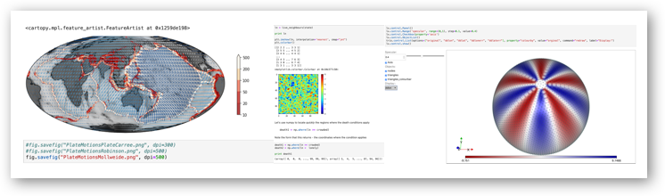

## Python for Geoscientists

A notebook-based introduction to python, jupyter notebooks and programming workflows with examples from python packages for the Earth Sciences.




The material is broken down into a number of sections of, approximately, increasing difficulty. 

  1. [Introduction to python / jupyter](CourseContent/Notebooks/Introduction2Python/1-IntroductionToIpython.ipynb)
  1. [Introduction to version control with git](CourseContent/Notebooks/Introduction2VersionControl/1-GettingStartedWithGit.ipynb)
  1. [Getting Started with Numpy / Scipy](CourseContent/Notebooks/Numpy+Scipy/1-IntroductionToNumpy.ipynb)
  1. [Introduction to Matplotlib](CourseContent/Notebooks/Plotting/1-IntroductionToMatplotlib.ipynb)
  1. [Stripy for meshing / mapping the Sphere](CourseContent/Notebooks/SphericalMeshing/SphericalTriangulations/Ex1-Spherical-Triangulations.ipynb)
  1. [Making beautiful and useful maps with Cartopy](CourseContent/Notebooks/Mapping/0-Preliminaries.ipynb)
  1. [Finite Differences with numpy](CourseContent/Notebooks/SolveMathProblems/1-IntroductionToNumericalSolutions.ipynb)
 
 
### Description

Python has become a popular language for scientific computing, boasting a rich set of libraries
relevant to geoscientists working with data. It has all the friendly features and conveniences you
would expect of a modern programming language. The Python programming language offers
adaptability and versatility to the types of analyses, modelling, and workflows that geoscientists
utilise. The tools and workflows you will explore in this course are presented as Jupyter notebooks
and can easily be adapted to your own research.

We are also going to focus on problem-solving approaches to computation - developing a systematic approach to programming, testing, debugging and documentation. We will make use of git for version control which is a tool / strategy that you will definitely find helpful in future. We will do all of our work within the literate programming environment of jupyter notebooks / jupyter lab. 

We will introduce/review the 'standard' scientific python toolkits such as numpy, scipy, matplotlib, pandas. We will teach you how to manipulate and transform data in simple ways, plotting, mapping, visualisation, interpolation, gridding, function fitting, and exporting data / images into common, interchangeable data formats such as hdf5 and netcdf, geotiff.

We will learn how to orchestrate common earth science python software applications, seismic data set acquisition and analysis (obspy), meshing and interpolation (stripy). We will learn how to solve very simple differential equations with application to geothermal energy and ground water flow, statistical analysis of data sets.


### Dependencies

We have distributed this as a Docker image for portability, but it is possible to install python3 and additional dependencies on your computer to make this run natively:

- `numpy`
- `scipy`
- `matplotlib`
- `cartopy` (requires GDAL libraries)
- `lavavu` (for SphericalTriangulation notebooks only)
- `pandas`
- `scikit-learn`
- `obspy`
- `jupyter`

These may all be installed with **pip**:

```sh
python3 -m pip install jupyter
```

or through **conda**, which comes with [Anaconda](https://docs.anaconda.com/anaconda/install/):

```sh
conda install jupyter
```


### Acknowledgements

This coursework was created by a number of collaborators whom we want to acknowledge:

- Louis Moresi (for the course structure and the majority of the notebooks)
- Nathanial Butterworth (machine learning and introductionary notebooks)
- Rohitash Chandra (machine learning and data wrangling)
- Ben Mather (advanced finite difference notebooks)
